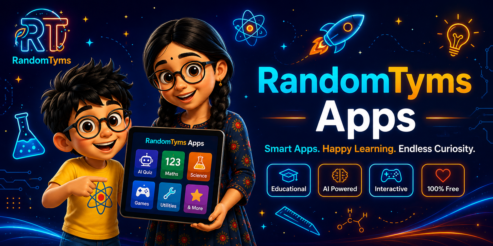
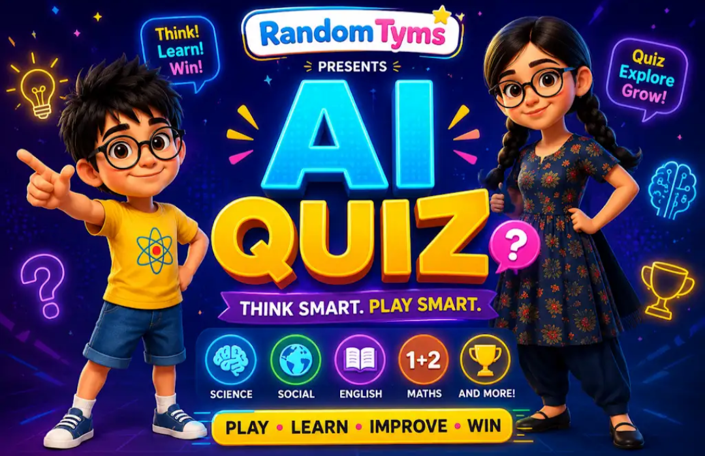
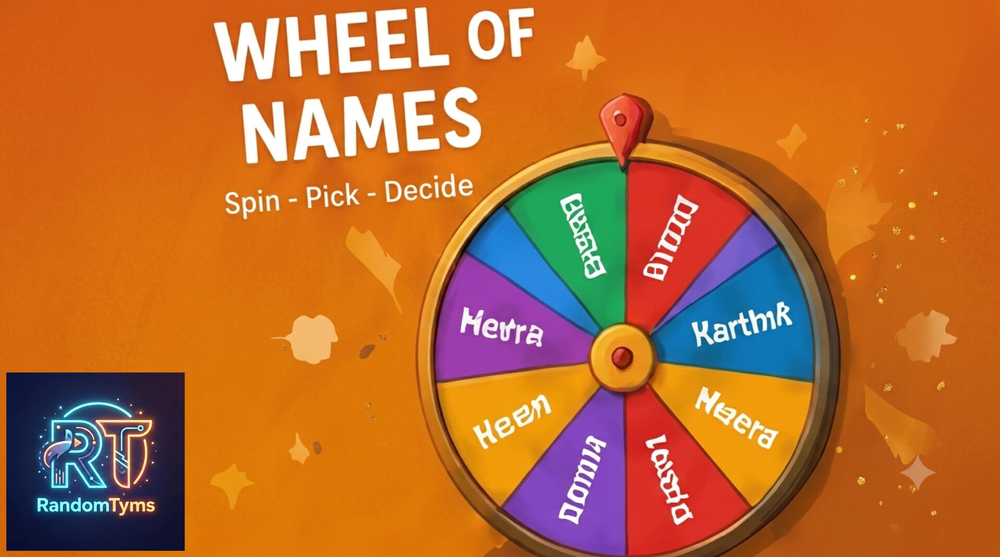
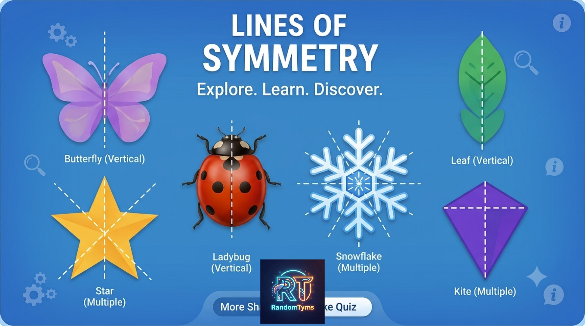
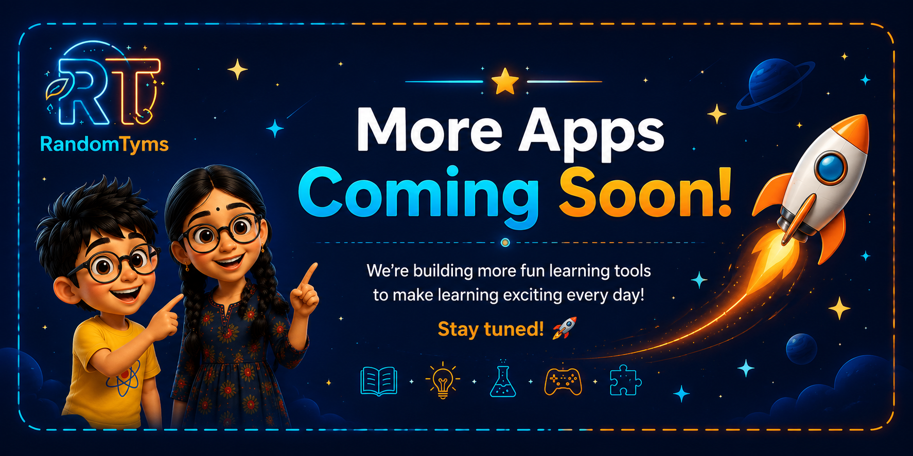

# 📱 RandomTyms Apps — Free Tamil & English Learning Apps for Kids (Class 1-8)

**Smart Apps. Happy Learning. Endless Curiosity.**

Free, AI-powered learning tools for kids — bilingual Tamil + English, for CBSE & Samacheer Kalvi — built independently on a smartphone by [Ganga Ponnu](https://lokeshvarsha.blogspot.com/), creator of AI-animated siblings **Lokesh & Varsha (8 & 13)**.

🔗 **Live App Hub (Installs like an app, no Play Store needed):** https://randomtyms.github.io/
📖 **Blog & Stories:** https://lokeshvarsha.blogspot.com/
🏆 ISEA State Level Award Winner | Official Tenor GIF Partner | Chennai

> For children who wear glasses to see themselves as HEROES, not side characters. Built solo, on one phone, with no studio or team.

---

## 🚀 What's Inside

Lightweight PWA that works offline after first install.

### 🧠 AI Textbook Quiz Generator [Class 5-10 | All Subjects]
Upload/scan textbook page → Instant MCQs with OMR bubbles + score feedback. Best for exam revision.

### 🎡 Spinner Wheel [Classroom Tool]
Random name picker & group maker for teachers.

### ✖️ Multiplication Practice [Class 2-5 | Maths]
Quick-fire table drills.

### 🔷 Symmetry Detective [Class 3-6 | Maths]
Learn lines of symmetry interactively.

More free tools coming — check hub weekly.

## ✨ Features

- 📦 Installable PWA — works offline, no Play Store
- 🔒 No sign-up, no ads, no tracking — 100% safe for kids
- 📝 Free worksheets library: [randomtyms-worksheets repo](https://github.com/randomtyms/randomtyms-worksheets)
- 📰 Live Blog + 🎬 Shorts inside the app
- 🎨 Built for low-end Android phones

## 👩‍🏫 For Teachers & Parents (10-min use)

**Teachers:** Open hub on smartboard → Use Spinner for groups → AI Quiz for 5-min recap → Print worksheets free.

**Parents:** Add to Home Screen → Kids practice offline. All Tamil + English.

## 🛠️ Built With — 100% Free Stack

HTML / CSS / JavaScript | GitHub Pages | Google Gemini API

## 🙋 About RandomTyms

Educational universe on Science, English, Tech, Cyber Safety (Digital Dharma), Space Secrets — centered on Lokesh & Varsha.

- 🏡 [Home](https://lokeshvarsha.blogspot.com/p/home.html)
- 🚀 [Space Secrets](https://lokeshvarsha.blogspot.com/p/space-secrets-series-lokesh-varsha.html)
- 🛡️ [Digital Dharma](https://lokeshvarsha.blogspot.com/p/digital-dharma-series-krishnas-timeless.html)

## 📄 License

MIT — Free for schools & families. Credit to RandomTyms.

---
⭐ Star this repo
