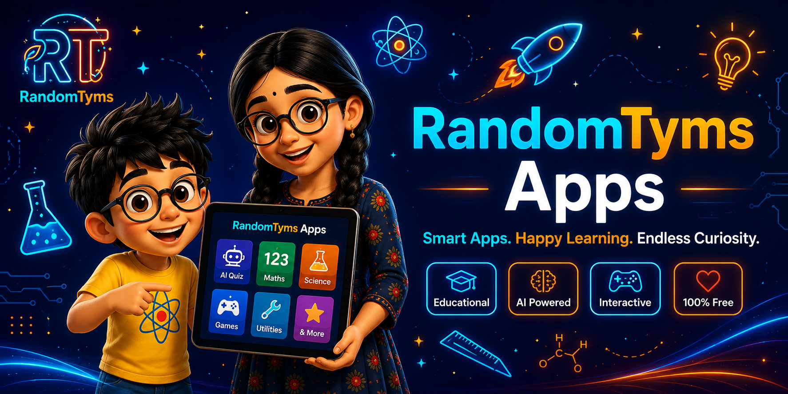
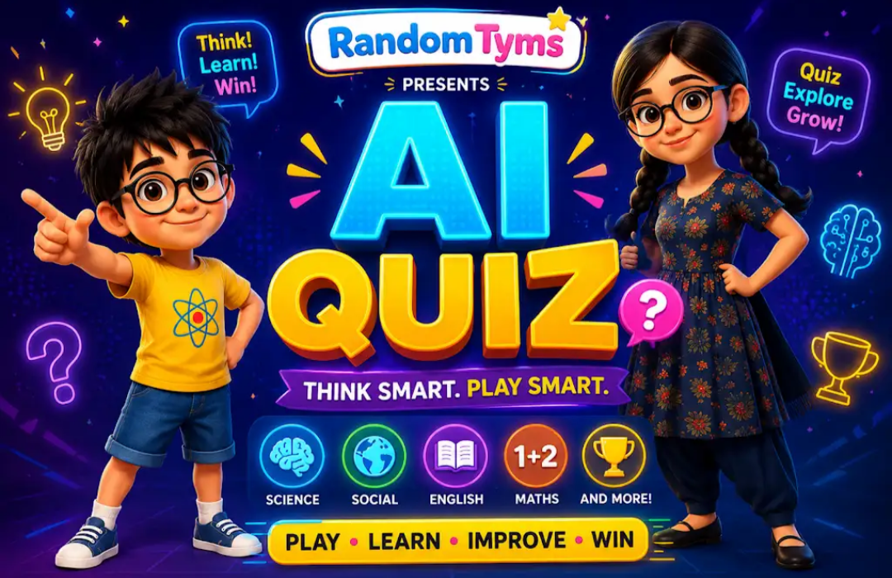

# 📱 RandomTyms Apps — Free Tamil & English Learning Hub for Kids (Class 1–8)

**Smart Apps. Happy Learning. Endless Curiosity.**

Free, offline-first educational web apps and AI learning tools built for CBSE & Samacheer Kalvi students. Developed independently on a single budget smartphone by [Ganga Ponnu](https://randomtyms.github.io/), creator of original Tamil animated siblings **Lokesh & Varsha**.

[🚀 Launch Web App](https://randomtyms.github.io/) • [🛍️ Microsoft Store](https://apps.microsoft.com/detail/9mw2xqb7wqbk) • [📖 Blog & Worksheets](https://lokeshvarsha.blogspot.com/) • [⭐ Star Repo](https://github.com/randomtyms/randomtyms.github.io)

> *"Created so children who wear glasses see themselves as heroes, not side characters. Built solo on one phone next to a home stove, with zero studio backing."*

---

## 📱 Mobile-First Engineering Pipeline

This repository is built under extreme device constraints, proving what the modern open web can achieve:

- **100% Smartphone Authored:** Every line of HTML, CSS, JavaScript, and asset configuration was written, tested, and pushed directly from an Android handset after a 13-year career break.
- **Continuous Mobile Git Workflow:** Rapid iteration and deployment cycles committed directly to GitHub Pages via mobile Git.
- **Offline-First Resilience:** Engineered with Service Workers and CacheStorage APIs to precache dynamic canvases and logic tools, ensuring smooth operation in low-bandwidth classrooms and rural networks without active data.
- **Zero Surveillance:** Completely client-side execution—no student account logins, no cookies, no tracking scripts, and no ads.

---

## 🚀 Interactive Apps & Tools

| App | Target & Subject | Description |
| :--- | :--- | :--- |
| **🧠 AI Textbook Quiz Generator** | Class 5–10 · All Subjects | Snap/upload any textbook page to generate instant MCQs with OMR bubbles and instant scoring. |
| **🎡 Classroom Spinner Wheel** | Teachers · Classroom Tool | Clean, instant name picker and group organizer for smartboards. |
| **✖️ Times Tables Quest** | Class 2–5 · Mathematics | Fast-paced interactive multiplication drills with progressive difficulty. |
| **🔷 Symmetry Detective** | Class 3–6 · Mathematics | Interactive visual canvas to identify and test lines of symmetry. |
| **🪐 3D Solar System** | Class 3–8 · Space Science | Interactive WebGL planetarium exploration paired with bilingual mini-lessons. |
| **🔐 Logic Lab & Ciphers** | Class 3–8 · Logic & Math | 15 Olympiad-level logic challenges, Caesar ciphers, and spatial reasoning tasks. |

---

## ✨ Core Highlights

- 📦 **Progressive Web App (PWA):** Installs directly to home screens or Windows desktop via Microsoft Store.
- 🔒 **Child-Safe by Design:** COPPA-compliant ethos—zero sign-up barriers, zero third-party telemetry, 100% free forever.
- 📝 **Open Educational Resources:** Free printable worksheets via [randomtyms-worksheets](https://github.com/randomtyms/randomtyms-worksheets).
- 🗣️ **Bilingual Pedagogy:** Blends Tamil, English, and Tanglish to make STEM accessible for Indian bilingual learners.
- ⚡ **Optimized for Budget Devices:** Ultra-lightweight footprint designed to run on entry-level Android devices.

---

## 👩‍🏫 Classroom & Home Usage

- **For Teachers (Smartboards):** Open the hub $\rightarrow$ use the Spinner for team picks $\rightarrow$ run the AI Quiz Generator for a 5-minute lesson recap $\rightarrow$ print free revision worksheets.
- **For Parents (Offline Mobile):** Tap *Add to Home Screen* $\rightarrow$ hand the phone to kids to practice math tables and logic games offline during travel or spotty connectivity.

---

## 🛠️ Built With

- **Frontend:** Vanilla JavaScript (ES6+), HTML5, CSS3, WebGL Canvas
- **PWA Architecture:** Service Worker lifecycle precaching, Web App Manifest
- **AI Integrations:** Google Gemini API
- **Deployment & Hosting:** GitHub Pages & GitHub Actions
- **Distribution:** Microsoft Store (via PWABuilder / TWA)

---

## 🌟 Recognition & Milestones

- 🏆 **National 2nd Prize Winner** — Ministry of Electronics and Information Technology (MeitY) ISEA National Competition 2025 (Cybersecurity Cartoon Storyboards).
- 📰 **Featured in *The Hindu's Education Plus*** — Highlighted for original regional character representation and accessible digital learning.
- 🚀 **Chromium Capabilities Showcase (Issue #555599827)** — Submitted to Google's Chromium tracker highlighting offline-first mobile web capabilities.
- 🛍️ **Microsoft Store Verified App** — Packaged and cleared for Windows desktop availability.
- 🎨 **Official Tenor Content Partner** — Animated sticker packs integrated across Gboard, WhatsApp, and messaging keyboards.

---

## 🙋 About RandomTyms & The Characters

Centered around **Lokesh (8)** and **Varsha (13)**, RandomTyms produces educational content spanning space science, English grammar, cybersecurity (*Digital Dharma*), and cultural storytelling:

- 🏡 [RandomTyms Universe Hub](https://lokeshvarsha.blogspot.com/p/home.html)
- 🛡️ [Digital Dharma Series (Child Cyber Safety)](https://lokeshvarsha.blogspot.com/p/digital-dharma-series-krishnas-timeless.html)
- 🚀 [Space Secrets Series](https://lokeshvarsha.blogspot.com/p/space-secrets-series-lokesh-varsha.html)

---

## 📄 License

Distributed under the **MIT License**. Free for schools, educators, and families.

---

⭐ **If you believe in accessible, privacy-first open education, consider starring this repository!**
